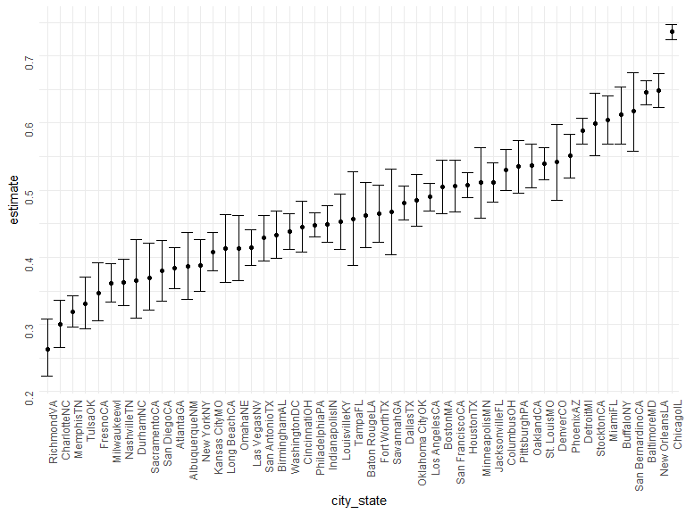

P8105\_HW5
================
Yijia Chen
2021-11-20

# Problem 1

clean the data

``` r
homicide_df = 
  read.csv("data/homicide-data.csv", na = c("", "Unknown")) %>% 
  mutate(
    city_state = str_c(city, state),
    resolution = case_when(
      disposition == "Closed without arrest" ~ "unsolved",
      disposition == "Open/No arrest"        ~ "unsolved",
      disposition == "Closed by arrest"      ~ "solved"
    )
    ) %>% 
  relocate(city_state) %>% 
  filter(city_state != "PA40.461945") %>% 
  filter(city_state != "TulsaAL")
```

Lets focus on Baltimore

``` r
baltimore_df = 
  homicide_df %>% 
  filter(city_state == "BaltimoreMD")

baltimore_summary = 
  baltimore_df %>% 
  summarize(
    unsolved = sum(resolution == "unsolved"),
    n = n()
  )

baltimore_test = 
  prop.test(
  x = baltimore_summary %>% pull(unsolved),
  n = baltimore_summary %>% pull(n)
)

baltimore_test %>% 
  broom::tidy()
```

    ## # A tibble: 1 x 8
    ##   estimate statistic  p.value parameter conf.low conf.high method    alternative
    ##      <dbl>     <dbl>    <dbl>     <int>    <dbl>     <dbl> <chr>     <chr>      
    ## 1    0.646      239. 6.46e-54         1    0.628     0.663 1-sample~ two.sided

Let’s try to iterate across cities

first off, write a function and test it on few sample city

``` r
prop_test_function = function(city_df) {
  
  city_summary = 
    city_df %>% 
    summarize(
      unsolved = sum(resolution == "unsolved"),
      n = n()
    )

  city_test = 
    prop.test(
     x = city_summary %>% pull(unsolved),
     n = city_summary %>% pull(n)
    )
  return(city_test)
  
}

prop_test_function(baltimore_df)
```

    ## 
    ##  1-sample proportions test with continuity correction
    ## 
    ## data:  city_summary %>% pull(unsolved) out of city_summary %>% pull(n), null probability 0.5
    ## X-squared = 239.01, df = 1, p-value < 2.2e-16
    ## alternative hypothesis: true p is not equal to 0.5
    ## 95 percent confidence interval:
    ##  0.6275625 0.6631599
    ## sample estimates:
    ##         p 
    ## 0.6455607

``` r
homicide_df %>% 
  filter(city_state == "AlbuquerqueNM") %>% 
  prop_test_function()
```

    ## 
    ##  1-sample proportions test with continuity correction
    ## 
    ## data:  city_summary %>% pull(unsolved) out of city_summary %>% pull(n), null probability 0.5
    ## X-squared = 19.114, df = 1, p-value = 1.232e-05
    ## alternative hypothesis: true p is not equal to 0.5
    ## 95 percent confidence interval:
    ##  0.3372604 0.4375766
    ## sample estimates:
    ##         p 
    ## 0.3862434

now, lets iterate across all cities

``` r
results_df = 
  homicide_df %>% 
  nest(data = uid:resolution) %>% 
  mutate(
    test_results = map(data, prop_test_function),
    tidy_results = map(test_results, broom::tidy)
  ) %>% 
  select(city_state, tidy_results) %>% 
  unnest(tidy_results) %>% 
  select(city_state, estimate, starts_with("conf"))
```

try to make a plot showing estimates and confidence intervals

``` r
results_df %>% 
  mutate(city_state = fct_reorder(city_state, estimate)) %>% 
  ggplot(aes(x = city_state, y = estimate)) +
  geom_point() +
  geom_errorbar(aes(ymin = conf.low, ymax = conf.high)) +
  theme(axis.text = element_text(angle = 90, vjust = 0.5, hjust = 1))
```



# Problem 2

reate a tidy dataframe containing data from all participants, including
the subject ID, arm, and observations over time

``` r
file_base = "./data/hw5_data/"

read_function = function(file) {
  
  arm_data = 
    file_name = str_c(file_base, file)
    read_csv(file_name) %>% 
    pivot_longer(
      week_1:week_8,
      names_to = 
    )
  
}


arm_df = 
  tibble(
    name = list.files("./data/hw5_data/")
    ) %>% 
  mutate(
    data = map(name, read_function)
  ) 
```

    ## Rows: 1 Columns: 8

    ## -- Column specification --------------------------------------------------------
    ## Delimiter: ","
    ## dbl (8): week_1, week_2, week_3, week_4, week_5, week_6, week_7, week_8

    ## 
    ## i Use `spec()` to retrieve the full column specification for this data.
    ## i Specify the column types or set `show_col_types = FALSE` to quiet this message.

    ## Rows: 1 Columns: 8

    ## -- Column specification --------------------------------------------------------
    ## Delimiter: ","
    ## dbl (8): week_1, week_2, week_3, week_4, week_5, week_6, week_7, week_8

    ## 
    ## i Use `spec()` to retrieve the full column specification for this data.
    ## i Specify the column types or set `show_col_types = FALSE` to quiet this message.

    ## Rows: 1 Columns: 8

    ## -- Column specification --------------------------------------------------------
    ## Delimiter: ","
    ## dbl (8): week_1, week_2, week_3, week_4, week_5, week_6, week_7, week_8

    ## 
    ## i Use `spec()` to retrieve the full column specification for this data.
    ## i Specify the column types or set `show_col_types = FALSE` to quiet this message.

    ## Rows: 1 Columns: 8

    ## -- Column specification --------------------------------------------------------
    ## Delimiter: ","
    ## dbl (8): week_1, week_2, week_3, week_4, week_5, week_6, week_7, week_8

    ## 
    ## i Use `spec()` to retrieve the full column specification for this data.
    ## i Specify the column types or set `show_col_types = FALSE` to quiet this message.

    ## Rows: 1 Columns: 8

    ## -- Column specification --------------------------------------------------------
    ## Delimiter: ","
    ## dbl (8): week_1, week_2, week_3, week_4, week_5, week_6, week_7, week_8

    ## 
    ## i Use `spec()` to retrieve the full column specification for this data.
    ## i Specify the column types or set `show_col_types = FALSE` to quiet this message.

    ## Rows: 1 Columns: 8

    ## -- Column specification --------------------------------------------------------
    ## Delimiter: ","
    ## dbl (8): week_1, week_2, week_3, week_4, week_5, week_6, week_7, week_8

    ## 
    ## i Use `spec()` to retrieve the full column specification for this data.
    ## i Specify the column types or set `show_col_types = FALSE` to quiet this message.

    ## Rows: 1 Columns: 8

    ## -- Column specification --------------------------------------------------------
    ## Delimiter: ","
    ## dbl (8): week_1, week_2, week_3, week_4, week_5, week_6, week_7, week_8

    ## 
    ## i Use `spec()` to retrieve the full column specification for this data.
    ## i Specify the column types or set `show_col_types = FALSE` to quiet this message.

    ## Rows: 1 Columns: 8

    ## -- Column specification --------------------------------------------------------
    ## Delimiter: ","
    ## dbl (8): week_1, week_2, week_3, week_4, week_5, week_6, week_7, week_8

    ## 
    ## i Use `spec()` to retrieve the full column specification for this data.
    ## i Specify the column types or set `show_col_types = FALSE` to quiet this message.

    ## Rows: 1 Columns: 8

    ## -- Column specification --------------------------------------------------------
    ## Delimiter: ","
    ## dbl (8): week_1, week_2, week_3, week_4, week_5, week_6, week_7, week_8

    ## 
    ## i Use `spec()` to retrieve the full column specification for this data.
    ## i Specify the column types or set `show_col_types = FALSE` to quiet this message.

    ## Rows: 1 Columns: 8

    ## -- Column specification --------------------------------------------------------
    ## Delimiter: ","
    ## dbl (8): week_1, week_2, week_3, week_4, week_5, week_6, week_7, week_8

    ## 
    ## i Use `spec()` to retrieve the full column specification for this data.
    ## i Specify the column types or set `show_col_types = FALSE` to quiet this message.

    ## Rows: 1 Columns: 8

    ## -- Column specification --------------------------------------------------------
    ## Delimiter: ","
    ## dbl (8): week_1, week_2, week_3, week_4, week_5, week_6, week_7, week_8

    ## 
    ## i Use `spec()` to retrieve the full column specification for this data.
    ## i Specify the column types or set `show_col_types = FALSE` to quiet this message.

    ## Rows: 1 Columns: 8

    ## -- Column specification --------------------------------------------------------
    ## Delimiter: ","
    ## dbl (8): week_1, week_2, week_3, week_4, week_5, week_6, week_7, week_8

    ## 
    ## i Use `spec()` to retrieve the full column specification for this data.
    ## i Specify the column types or set `show_col_types = FALSE` to quiet this message.

    ## Rows: 1 Columns: 8

    ## -- Column specification --------------------------------------------------------
    ## Delimiter: ","
    ## dbl (8): week_1, week_2, week_3, week_4, week_5, week_6, week_7, week_8

    ## 
    ## i Use `spec()` to retrieve the full column specification for this data.
    ## i Specify the column types or set `show_col_types = FALSE` to quiet this message.

    ## Rows: 1 Columns: 8

    ## -- Column specification --------------------------------------------------------
    ## Delimiter: ","
    ## dbl (8): week_1, week_2, week_3, week_4, week_5, week_6, week_7, week_8

    ## 
    ## i Use `spec()` to retrieve the full column specification for this data.
    ## i Specify the column types or set `show_col_types = FALSE` to quiet this message.

    ## Rows: 1 Columns: 8

    ## -- Column specification --------------------------------------------------------
    ## Delimiter: ","
    ## dbl (8): week_1, week_2, week_3, week_4, week_5, week_6, week_7, week_8

    ## 
    ## i Use `spec()` to retrieve the full column specification for this data.
    ## i Specify the column types or set `show_col_types = FALSE` to quiet this message.

    ## Rows: 1 Columns: 8

    ## -- Column specification --------------------------------------------------------
    ## Delimiter: ","
    ## dbl (8): week_1, week_2, week_3, week_4, week_5, week_6, week_7, week_8

    ## 
    ## i Use `spec()` to retrieve the full column specification for this data.
    ## i Specify the column types or set `show_col_types = FALSE` to quiet this message.

    ## Rows: 1 Columns: 8

    ## -- Column specification --------------------------------------------------------
    ## Delimiter: ","
    ## dbl (8): week_1, week_2, week_3, week_4, week_5, week_6, week_7, week_8

    ## 
    ## i Use `spec()` to retrieve the full column specification for this data.
    ## i Specify the column types or set `show_col_types = FALSE` to quiet this message.

    ## Rows: 1 Columns: 8

    ## -- Column specification --------------------------------------------------------
    ## Delimiter: ","
    ## dbl (8): week_1, week_2, week_3, week_4, week_5, week_6, week_7, week_8

    ## 
    ## i Use `spec()` to retrieve the full column specification for this data.
    ## i Specify the column types or set `show_col_types = FALSE` to quiet this message.

    ## Rows: 1 Columns: 8

    ## -- Column specification --------------------------------------------------------
    ## Delimiter: ","
    ## dbl (8): week_1, week_2, week_3, week_4, week_5, week_6, week_7, week_8

    ## 
    ## i Use `spec()` to retrieve the full column specification for this data.
    ## i Specify the column types or set `show_col_types = FALSE` to quiet this message.

    ## Rows: 1 Columns: 8

    ## -- Column specification --------------------------------------------------------
    ## Delimiter: ","
    ## dbl (8): week_1, week_2, week_3, week_4, week_5, week_6, week_7, week_8

    ## 
    ## i Use `spec()` to retrieve the full column specification for this data.
    ## i Specify the column types or set `show_col_types = FALSE` to quiet this message.

# Problem 3
