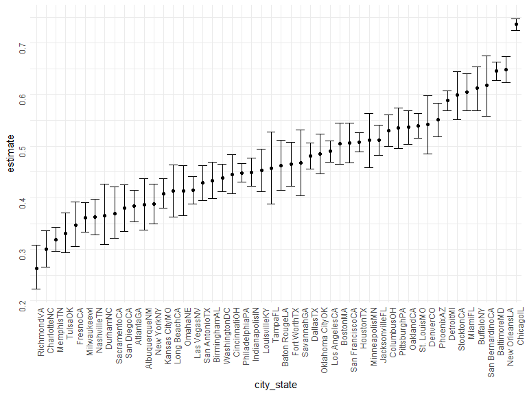
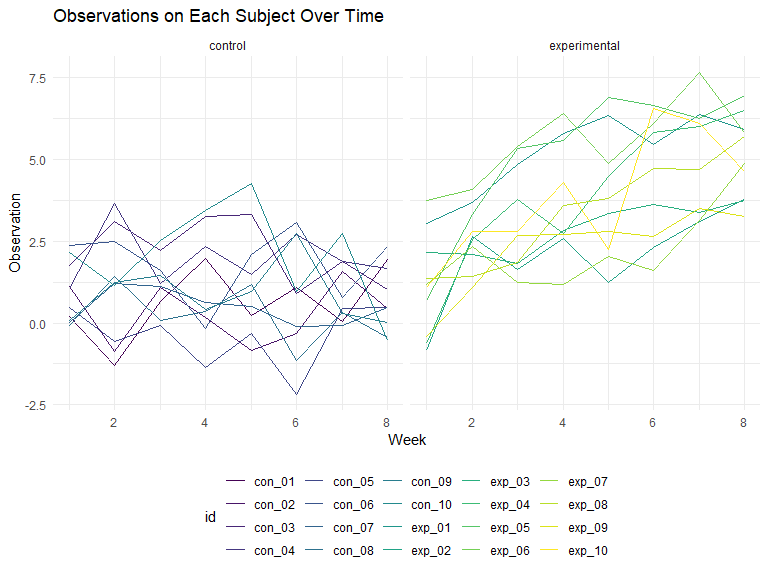

P8105\_HW5
================
Yijia Chen
2021-11-20

# Problem 1

Clean the data.

``` r
homicide_df = 
  read.csv("data/homicide-data.csv", na = c("", "Unknown")) %>% 
  mutate(
    city_state = str_c(city, state),
    resolution = case_when(
      disposition == "Closed without arrest" ~ "unsolved",
      disposition == "Open/No arrest"        ~ "unsolved",
      disposition == "Closed by arrest"      ~ "solved"
    )
    ) %>% 
  relocate(city_state) %>% 
  filter(city_state != "PA40.461945") %>% 
  filter(city_state != "TulsaAL")
```

Let’s focus on Baltimore

``` r
baltimore_df = 
  homicide_df %>% 
  filter(city_state == "BaltimoreMD")

baltimore_summary = 
  baltimore_df %>% 
  summarize(
    unsolved = sum(resolution == "unsolved"),
    n = n()
  )

baltimore_test = 
  prop.test(
  x = baltimore_summary %>% pull(unsolved),
  n = baltimore_summary %>% pull(n)
)

baltimore_test %>% 
  broom::tidy()
```

    ## # A tibble: 1 x 8
    ##   estimate statistic  p.value parameter conf.low conf.high method    alternative
    ##      <dbl>     <dbl>    <dbl>     <int>    <dbl>     <dbl> <chr>     <chr>      
    ## 1    0.646      239. 6.46e-54         1    0.628     0.663 1-sample~ two.sided

Let’s try to iterate across cities.

First, write a function and test it on few sample city

``` r
prop_test_function = function(city_df) {
  
  city_summary = 
    city_df %>% 
    summarize(
      unsolved = sum(resolution == "unsolved"),
      n = n()
    )

  city_test = 
    prop.test(
     x = city_summary %>% pull(unsolved),
     n = city_summary %>% pull(n)
    )
  return(city_test)
  
}

prop_test_function(baltimore_df)
```

    ## 
    ##  1-sample proportions test with continuity correction
    ## 
    ## data:  city_summary %>% pull(unsolved) out of city_summary %>% pull(n), null probability 0.5
    ## X-squared = 239.01, df = 1, p-value < 2.2e-16
    ## alternative hypothesis: true p is not equal to 0.5
    ## 95 percent confidence interval:
    ##  0.6275625 0.6631599
    ## sample estimates:
    ##         p 
    ## 0.6455607

``` r
homicide_df %>% 
  filter(city_state == "AlbuquerqueNM") %>% 
  prop_test_function()
```

    ## 
    ##  1-sample proportions test with continuity correction
    ## 
    ## data:  city_summary %>% pull(unsolved) out of city_summary %>% pull(n), null probability 0.5
    ## X-squared = 19.114, df = 1, p-value = 1.232e-05
    ## alternative hypothesis: true p is not equal to 0.5
    ## 95 percent confidence interval:
    ##  0.3372604 0.4375766
    ## sample estimates:
    ##         p 
    ## 0.3862434

Now, let’s iterate across all cities

``` r
results_df = 
  homicide_df %>% 
  nest(data = uid:resolution) %>% 
  mutate(
    test_results = map(data, prop_test_function),
    tidy_results = map(test_results, broom::tidy)
  ) %>% 
  select(city_state, tidy_results) %>% 
  unnest(tidy_results) %>% 
  select(city_state, estimate, starts_with("conf"))
```

Try to make a plot showing estimates and confidence intervals

``` r
results_df %>% 
  mutate(city_state = fct_reorder(city_state, estimate)) %>% 
  ggplot(aes(x = city_state, y = estimate)) +
  geom_point() +
  geom_errorbar(aes(ymin = conf.low, ymax = conf.high)) +
  theme(axis.text = element_text(angle = 90, vjust = 0.5, hjust = 1))
```



# Problem 2

Create a tidy dataframe containing data from all participants, including
the subject ID, arm, and observations over time

Create read\_csv function.

``` r
file_base = "./data/hw5_data/"

read_function = function(file) {
  
  arm_data = 
    file_name = str_c(file_base, file)
    read_csv(file_name) %>% 
    pivot_longer(
      week_1:week_8,
      names_to = "week",
      names_prefix = "week_",
      values_to = "observation"
    )
  
}
```

1.  Iterate over file names and read in data for each subject using
    purrr::map and saving the result as a new variable in the dataframe.

2.  Tidy the result; manipulate file names to include control arm and
    subject ID, make sure weekly observations are “tidy”, and do any
    other tidying that’s necessary

``` r
arm_df = 
  tibble(
    name = list.files("./data/hw5_data/")
    ) %>% 
  mutate(
    data = map(name, read_function)
  ) 

arm_df %>% 
  unnest(data) %>% 
  mutate(
    week = as.numeric(week),
    id = str_remove(name, ".csv"),
    arm_type = case_when(str_detect(name, "con") ~ "control",
                         str_detect(name, "exp") ~ "experimental")
  ) %>% 
  select(-name) %>% 
  relocate(id, arm_type) %>% 
  ggplot(aes(x = week, y = observation, color = id)) +
  geom_line() +
  facet_grid(. ~ arm_type) +
  labs(
    title = "Observations on Each Subject Over Time",
    y = "Observation",
    x = "Week"
  )
```



Overall, the experimental group has a higher value for observation than
control group. Also, the values of observation for experimental group
show a increasing trend from week 1 to week 8. The values of observation
for control group do not show evident increased or decreased trend from
week 1 to week 8.

# Problem 3

Load the “iris” dataset

``` r
library(tidyverse)

set.seed(10)

iris_with_missing = iris %>% 
  map_df(~replace(.x, sample(1:150, 20), NA)) %>%
  mutate(Species = as.character(Species))
```

1.  For numeric variables, you should fill in missing values with the
    mean of non-missing values.

2.  For character variables, you should fill in missing values with
    “virginica”.

``` r
fill_in_missing = function(vector) {
  
  if (is.numeric(vector)) {
    vector = ifelse(is.na(vector), mean(vector, na.rm = TRUE), vector)
  }
  
  if (is.character(vector)) {
    vector = ifelse(is.na(vector), "virginica", vector)
  }
  
  return(vector)
  
}

iris_fillin = 
  map(iris_with_missing, fill_in_missing) %>% 
  as_tibble()


table(is.na(iris_fillin))
```

    ## 
    ## FALSE 
    ##   750
